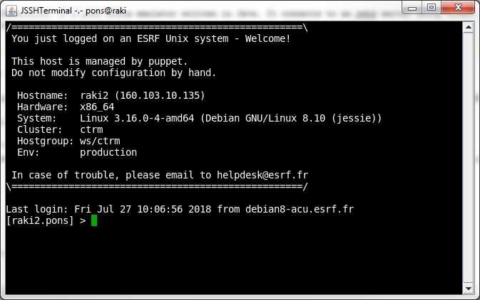
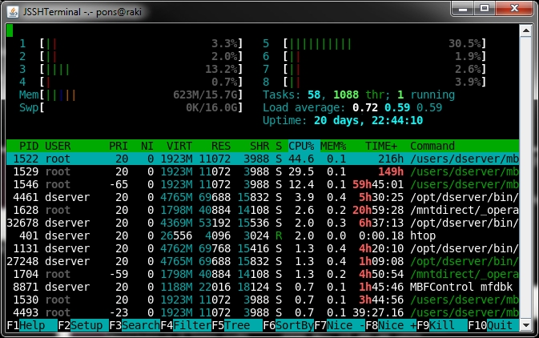

# JSSHTerminal

JSSHTerminal is a xterm emulator written 100% in Java. It connects to an sshd server using JCraft Java Secure Channel.
JSSHTerminal supports X11 forwarding and X11 authorization (MIT Magic Cookies).

## Installing

Build the project with maven and install JSSHTerminal-VERSION.jar or download JSSHTerminal-VERSION.jar from [bintray](https://bintray.com/tango-controls/maven/JSSHTerminal)

## Running JSSHTerminal

'''
java -cp JSSHTerminal-VERSION.jar JSSHTerminal.MainPanel username@host [-p password] [-P port] [-y] [-s WxHxS] [-X] [-c command]
       username@host username used to login on host
       -p password password used to login
       -P SSH port number (default is 22)
       -y Answer yes to question
       -s WxHxS terminal size WidthxHeightxScrollbar
       -X Enable X11 forwarding
       -c command Execute command after connection
'''